# Projeto: GitOps com ArgoCD no Kubernetes

Este guia apresenta um passo a passo para configurar um fluxo GitOps utilizando o ArgoCD em um ambiente Kubernetes, com foco em automação de deploys e versionamento de configurações.


1. [Visão geral e requisitos](#visão-geral-e-requisitos)
2. [Preparando o repositório](#preparando-o-repositório)
3. [Instalação das ferramentas](#instalação-das-ferramentas)
4. [Deploy do ArgoCD](#deploy-do-argocd)
5. [Acesso ao painel do ArgoCD](#acesso-ao-painel-do-argocd)
6. [Cadastro e sincronização de aplicações](#cadastro-e-sincronização-de-aplicações)
7. [Acesso ao front-end da aplicação](#acesso-ao-front-end-da-aplicação)

---

# Visao geral e requisitos

Este repositório demonstra como implementar um pipeline GitOps para um microserviço, utilizando o ArgoCD para gerenciar o ciclo de vida das aplicações no Kubernetes.

**Pré-requisitos:**
- Docker Desktop
- kubectl
- ArgoCD
- Conta no GitHub
- Git
- Manifesto YAML da aplicação

---

# Preparando o repositório

## Fork ou novo repositório

Você pode criar um fork do [repositório original](https://github.com/GoogleCloudPlatform/microservices-demo) no GitHub, ou iniciar um repositório próprio e adicionar o manifesto necessário.

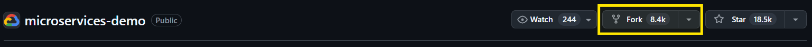

**Via terminal:**
```bash
git clone https://github.com/SEU_USUARIO/NOME_DO_REPOSITORIO
cd NOME_DO_REPOSITORIO
git remote add upstream https://github.com/GoogleCloudPlatform/microservices-demo
```

**Novo repositório:**
```bash
mkdir nome-do-repositorio
cd nome-do-repositorio
git init
mkdir -p gitops-microservice/k8s
cp /caminho/para/manifesto.yaml ./gitops-microservice/k8s/online-boutique.yaml
git add .
git commit -m "Manifesto do microservico"
git remote add origin <url_do_seu_repositorio>
git push -u origin main
```

---

# Instalação das ferramentas

- Instale o Docker Desktop conforme a [documentação oficial](https://docs.docker.com/get-started/).
- O kubectl pode ser instalado junto ou separadamente, veja [aqui](https://kubernetes.io/docs/tasks/tools/).
- Para o Git, siga o [site oficial](https://git-scm.com/downloads).

**Testando as ferramentas:**
```bash
kubectl get nodes
docker --version
git --version
```
Se os comandos retornarem informações, está tudo pronto.

---

# Deploy do ArgoCD

Para instalar o ArgoCD no cluster Kubernetes:
```bash
kubectl create namespace argocd
kubectl apply -n argocd -f https://raw.githubusercontent.com/argoproj/argo-cd/stable/manifests/install.yaml
```

---

# Acesso ao painel do ArgoCD

Exponha o serviço do ArgoCD localmente:
```bash
kubectl port-forward svc/argocd-server -n argocd 8080:443
```
Acesse `http://localhost:8080` no navegador.

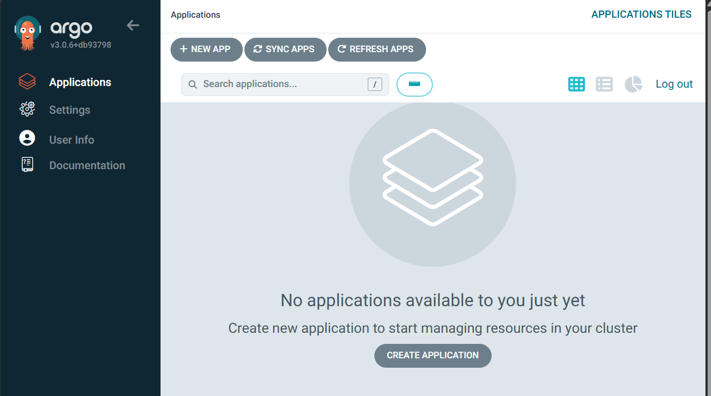

**Recuperando a senha do usuário admin:**
- Linux/macOS:
```bash
kubectl -n argocd get secret argocd-initial-admin-secret -o jsonpath="{.data.password}" | base64 -d
```
- Windows:
```powershell
$base64String = kubectl -n argocd get secret argocd-initial-admin-secret -o jsonpath="{.data.password}"
[System.Text.Encoding]::UTF8.GetString([System.Convert]::FromBase64String($base64String))
```

---

# Cadastro e sincronização de aplicações

No painel do ArgoCD:
1. Vá em "Settings" > "Repositories" e conecte seu repositório Git.

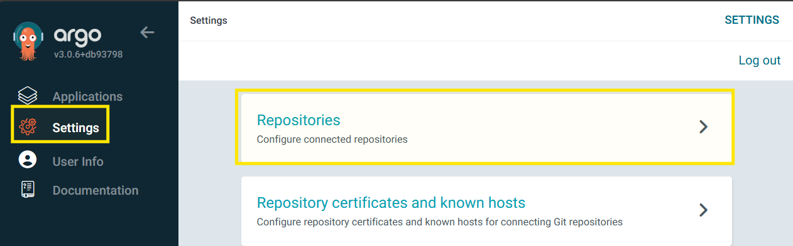

2. Clique em "Connect Repo".

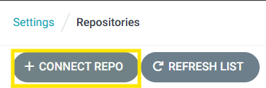

3. Preencha os campos:
   - Nome da aplicação
   - Projeto
   - Caminho: `gitops-microservice/k8s`
   - Cluster: in-cluster
   - Namespace: default
   - Outras opções: PRUNE RESOURCES, SELF HEAL, AUTO-CREATE NAMESPACE

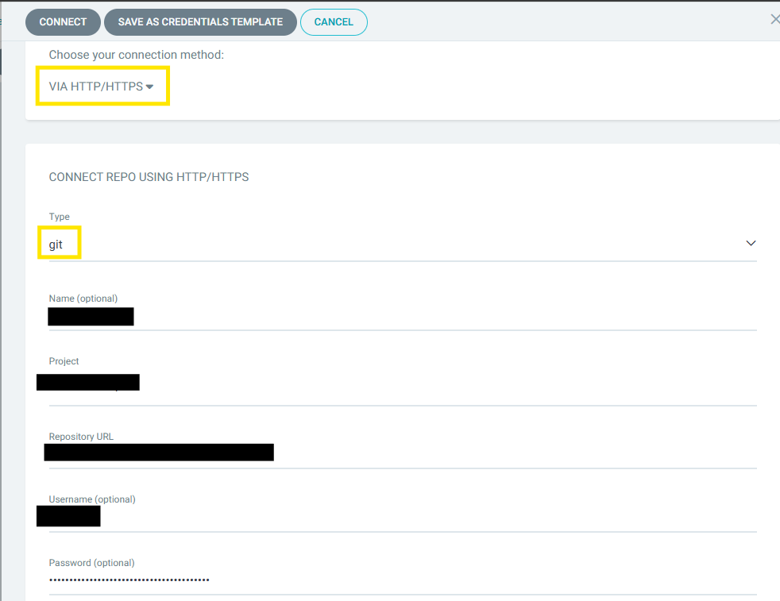

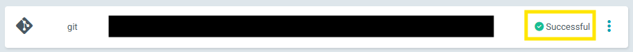

Agora, crie a aplicação:

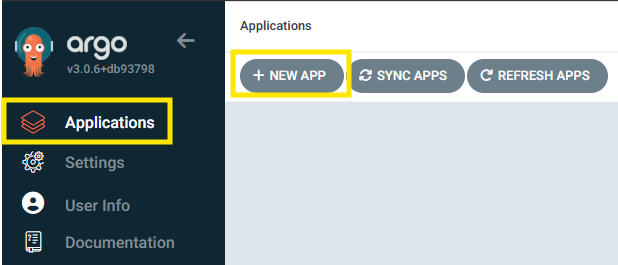

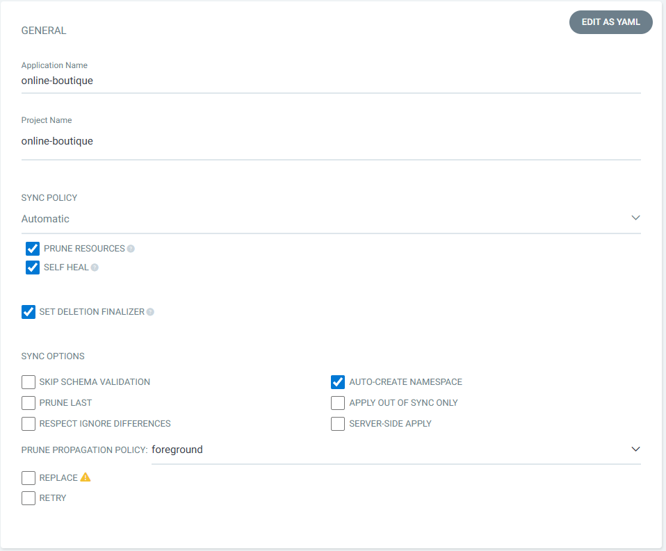

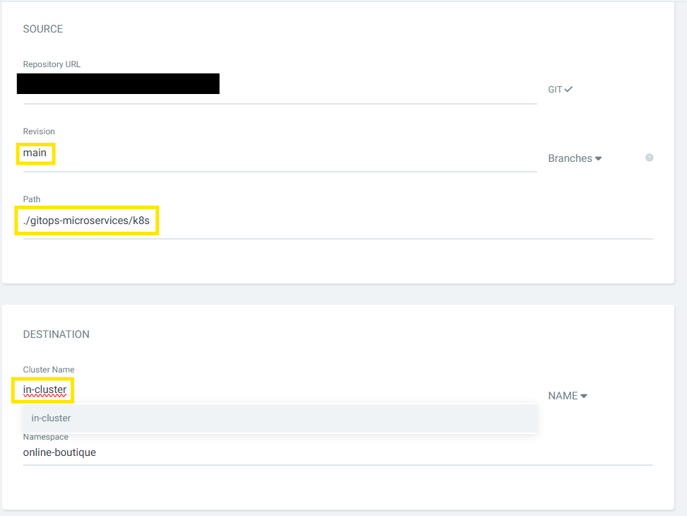

**Manifesto YAML de exemplo:**
```yaml
apiVersion: argoproj.io/v1alpha1
kind: Application
metadata:
  name: online-boutique
spec:
  destination:
    name: in-cluster
    namespace: online-boutique
  source:
    path: ./gitops-microservices/k8s
    repoURL: <url_do_seu_repositorio>
    targetRevision: main
  project: default
  syncPolicy:
    automated:
      prune: true
      selfHeal: true
    syncOptions:
      - CreateNamespace=true
```
Clique em "Sync" para aplicar.

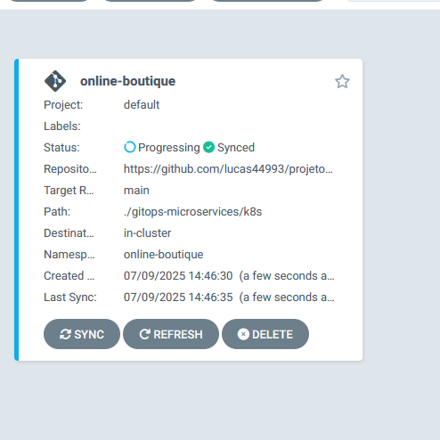

---

# Acesso ao front-end da aplicação

Para expor o serviço do front-end:
```powershell
kubectl get services --all-namespaces | Select-String "frontend-external"
kubectl port-forward svc/frontend-external 80:80 -n online-boutique
```

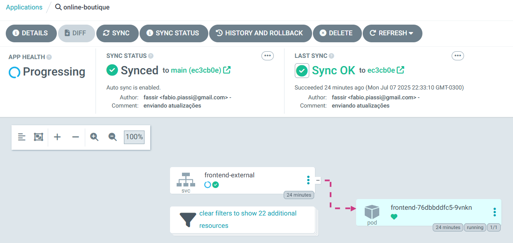

Acesse `http://localhost:80` no navegador.

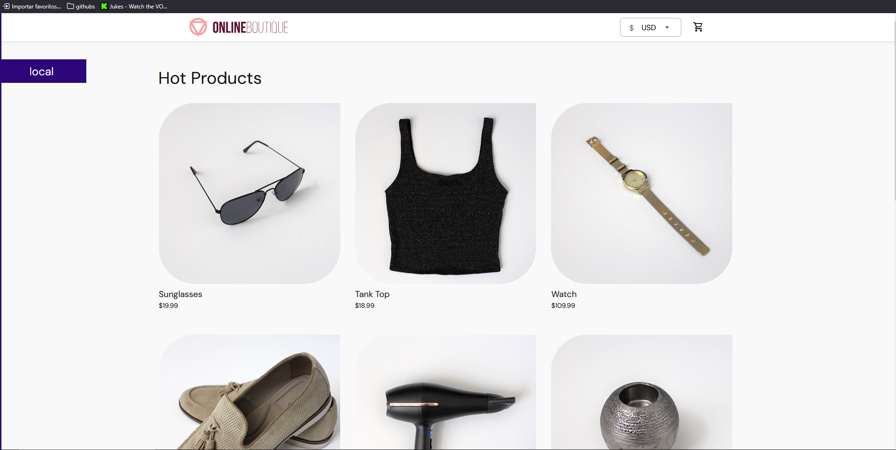

---